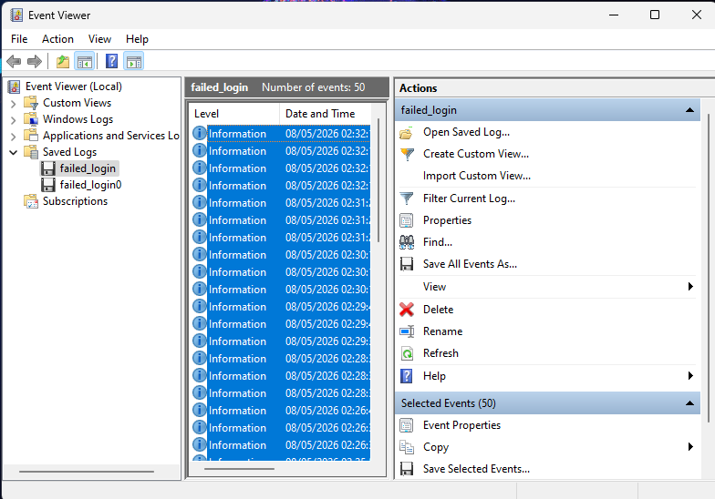
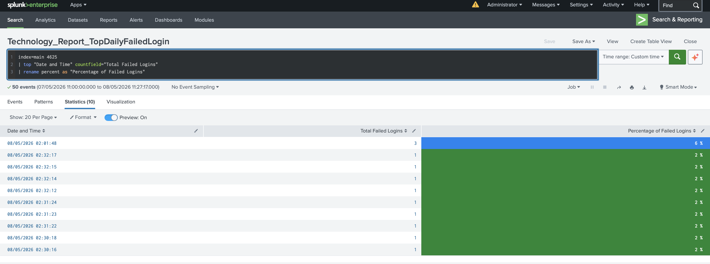
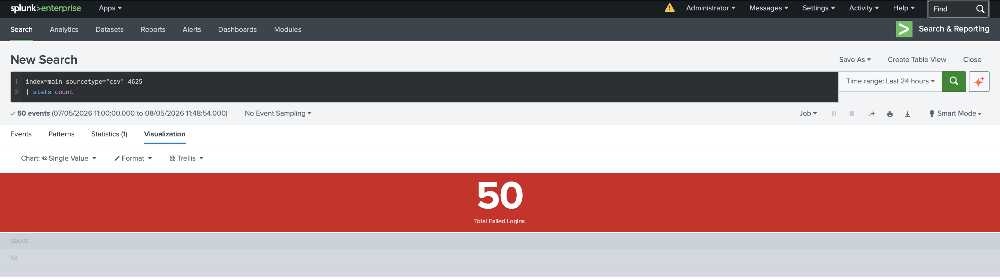
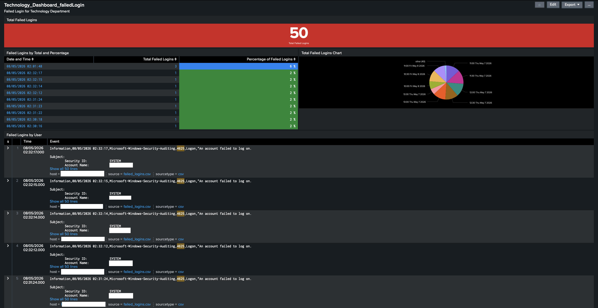
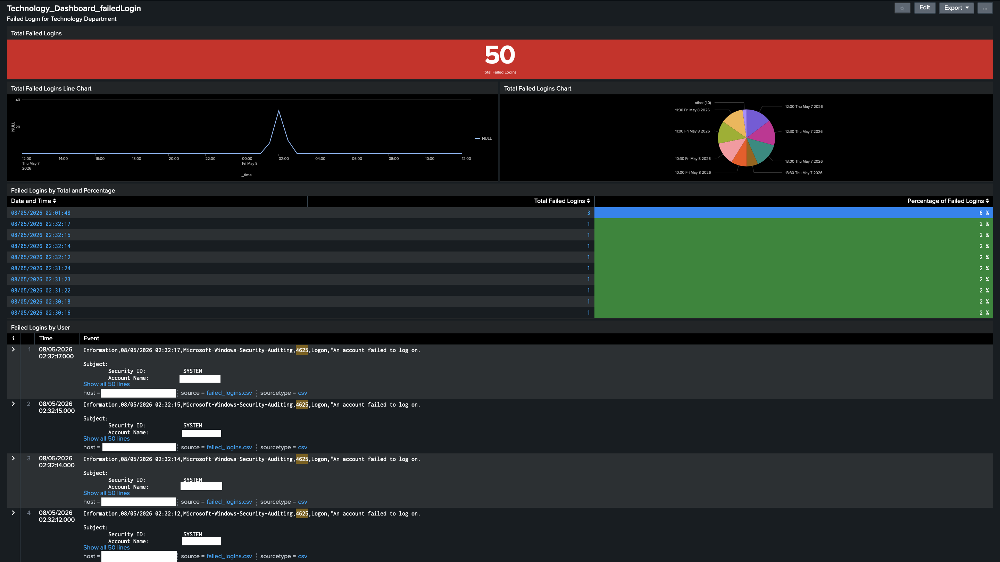
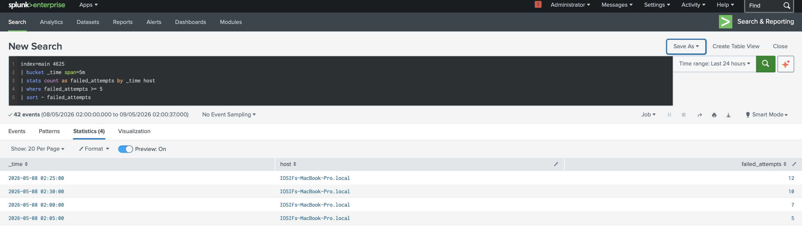
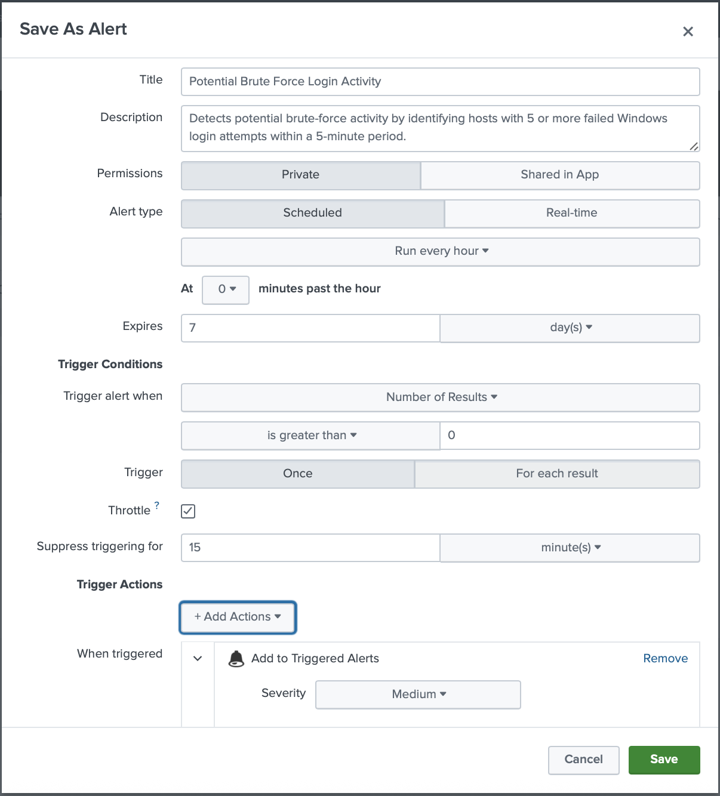

</> Markdown

# Splunk Failed Login Dashboard

## Overview
This project demonstrates the creation of a cybersecurity monitoring dashboard in Splunk focused on analyzing Windows failed authentication events (Event ID 4625). The dashboard was built using manually generated Windows failed login attempts collected through Event Viewer and imported into Splunk for SIEM-based monitoring and analysis. 

The purpose of this project is to simulate basic SOC (Security Operations Center) monitoring workflows by visualizing authentication failures, tracking suspicious login behavior, and creating security-focused reporting panels.

---

# Objectives
- Generate Windows failed login events using Events Viewer
- Export and ingest Windows security logs into Splunk
- Analyze authentication failures using SPL (Search Processing Language)
- Create visual dashboard panels for security monitoring
- Simulate SIEM-based detection and reporting workflows

---

# Technologies Used
- Splunk Enterprise
- Windows Event Viewer
- SPL
- Windows Security Logs
- Event ID 4625

---

# Dashboard Features 

## Failed Login Activity Monitoring
A visualization panel used to track failed login attempts over time and identify spikes in authentication failures.

## Statistical Reporting
Statistical tables displaying authentication failure date, event aggregation, and monitoring metrics for suspicious login activity.

## Single Value Metrics 
A KPI-style panel displaying the total number of failed login attempts detected in the imported logs.

## Detailed Event Reporting
A report table containing detailed authentication failure events used for investigation and security analysis.

---

## Event ID 4625
Event ID 4625 is a Windows Security event generated when a user authentication attempt fails. These events are commonly monitored in SOC environment to identify:
- Failed authentication attempts
- Potential brute-force attacks
- Unauthorized access attempts
- Suspicious login activity

---

# Log Generation Process
Failed login events were manually generated in a Windows environment by performing repeated unsuccessful authentication attempts. The generated security events were filtered within Event Viewer and exported for ingestion into Splunk.

---

# Screenshots

## Event Viewer Failed Login Events 

## Statistical Report Panel

## Single Numeric Value Panel

## Final Dashboard

## Final Dashboard Five Panels

---

# Skills Demonstrated
- SIEM dashboard creation
- Log ingestion and parsing
- Windows authentication monitoring
- SPL query development
- Cybersecurity event analysis
- Dashboard visualization
- Security reporting and investigation

---

# Future Improvements 
- Add brute-force detection logic
- Implement authentication anomaly detection
- Expand dashboard with aditional Windows security events
- Integrate alerting functionality
- Add geographic login analysis

---

# Author 
Cybersecurity and SIEM portofolio project created for hands-on Splunk practice and security monitoring experience. 

---

</> Markdown

# Alerting and Detection 

A scheduled Splunk alert was created to simulate basic SOC detection workflows for identifying potential brute-force login activity.

## Detection Logic
The alert identifies repeated failed authentication attempts occuring within a short time window using SPL-based aggregation and threshold analysis.

## Detection Features
- Threshold-based detection
- Time-window aggregation
- Alert suppression (throttling)
- Triger-based monitoring

## Alert Features 
- Scheduled alert execution
- Threshold-based detection
- Suppression interval to reduce repetitive alerting
- Trigger conditions based on failed login frequency

## SPL Detection Logic
'''spl
index=main 4625
| bucket _time span=5m
| stats count as failed_attempts by _time host
| where failed_attempts >= 5
| sort - failed_attempts 

## screenshots 

## Brute Force Detection Query 

## Brute Force Alert Configuration 

---

# Investigation Scenario

During testing, repeated failed authentication attempts were generated against a Windows account to simulate suspicious login behavior.

The dashboard and alerting logic were used to:
- Monitor authentication spikes
- Identify repeated login failures
- Aggregate failed login statistics
- Trigger brute-force detection alerts

This simulates a basic SOC investigation workflow using SIEM monitoring and event analysis.

# Skills Learned

- Splunk dashboard creation
- SPL query development
- Windows Security Event analysis
- Event ID 4625 monitoring
- SIEM alert configuration
- Authentication failure analysis
- Brute-force detection logic
- Log ingestion and parsing
